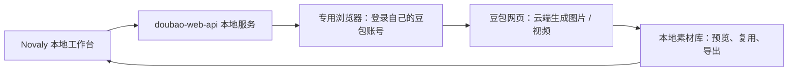
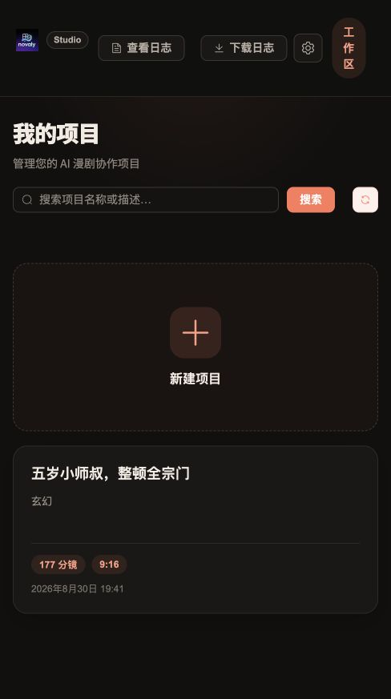
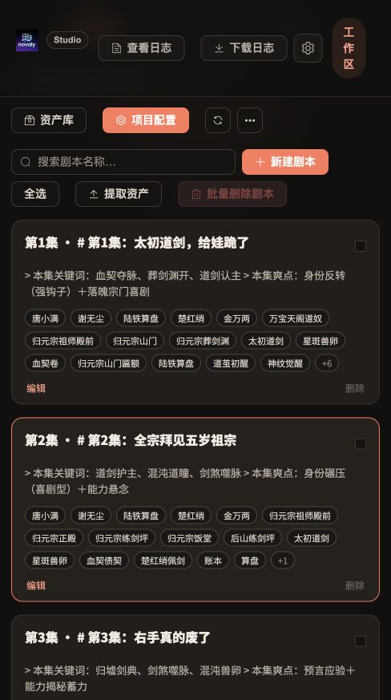
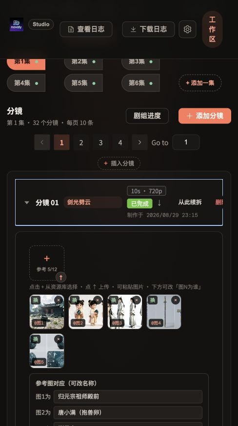

# Novaly Drama · 本地 AI 漫剧工作台

**更省钱地做 AI 漫剧：接入豆包网页版的图片、视频能力，剧本、分镜和素材都在本机管理。**

Novaly Drama 提供浏览器操作界面，内置 `doubao-web-api`。你可以在工作台里启动豆包服务，通过专用 Chrome 窗口登录豆包，再生成图片和视频。

项目文字、图片、视频都保存在本机。**不需要租服务器、配置云存储，也不用单独安装数据库。**

> **单机版不等于离线 AI。** 工作台和数据存储运行在本地；豆包及其他 AI 服务仍需联网。生成时，提示词、参考图片等会发送给你选择的服务。账号权限、可用模型和生成额度由对应服务决定。

[下载运行包](https://github.com/jobsonlook/novaly-drama/releases) · [为什么省钱](#为什么省钱) · [项目实拍](#看看真实项目) · [第一次使用](#第一次使用从下载安装到打开页面) · [Docker 部署](docs/docker.md) · [数据备份](#数据在哪里怎么备份)


*实际项目《五岁小师叔，整顿全宗门》的场景素材。下方有工作台截图和角色设定图。*

## 为什么省钱

**最大的特色，是内置 `doubao-web-api`，把豆包网页里的图片和视频生成能力接到漫剧工作流里。** 在自己的账号具备对应权限和额度时，可以复用网页端已有能力，减少另行购买按次计费图片 / 视频 API 的需求。无需自己在多个工具之间反复下载、上传、整理素材。

| 开支 | 本项目怎么减少 | 仍要注意 |
| --- | --- | --- |
| 图片、视频生成 | 通过本地 `doubao-web-api` 使用自己的豆包网页账号 | 是否免费、是否需要会员、剩余额度和排队时间，以账号实际显示为准 |
| 服务器 | 工作台直接跑在自己的电脑上 | 电脑需要保持运行，仍有硬件、电费和网络成本 |
| 云存储 | SQLite、上传图片和生成视频保存到本地，不需要 COS/TOS | 磁盘会逐渐占满，需要自己备份 |
| 重复制作 | 角色、场景、道具和已有视频可以在项目内复用 | 先确认参考素材和分镜，再提交生成，减少无效重试 |
| 文本、语音和其他模型 | 按需配置，不用的服务无需配置 | AI 写作、自动拆解、语音及其他供应商可能另行计费 |

> **省钱不等于永久免费、无限生成或绕过付费。** `doubao-web-api` 是本项目内置的网页适配服务，不是豆包官方开放平台 API；不会增加账号额度，也不保证与官方 API 一样的稳定性。网页改版、登录过期、风控、模型权限变化都可能影响使用。请仅使用自己有权使用的账号和内容，并遵守服务条款；不要用它绕过限制或共享登录信息。



**建议的省钱用法：** 手动写一个简单剧本 → 先固定角色与场景参考图 → 测试一个短镜头 → 确认画风和动作 → 再扩展到整集。排队时不要重复点击生成；能复用的素材先复用。

## 看看真实项目

以下来自本机项目《五岁小师叔，整顿全宗门》，用于展示真实工作流和素材组织方式。截图可能包含不同模型的历史产出，**不代表所有素材都由同一个模型生成，也不是效果保证**。界面会随版本更新。

### 从项目、剧本到分镜

<table>
<tr><th>① 管理项目</th><th>② 按集整理剧本</th><th>③ 分镜绑定参考图</th></tr>
<tr>
<td></td>
<td></td>
<td></td>
</tr>
</table>

分镜里可以把「图1为场景、图2为角色、图3为道具」对应清楚，再写动作和镜头文案。已有视频保留在项目里，便于预览和继续制作。

### 先把角色定下来，再重复使用

| 唐小满：主角参考 | 谢无尘：角色参考 |
| --- | --- |
|  |  |

### 同一套世界观里的场景库

| 归元宗药庐 | 后山竹林 |
| --- | --- |
|  |  |

这些图片是文档展示素材，不会自动导入你的数据库。仓库不包含完整剧集、视频、账号或创作数据库。

## 先了解它能做什么

| 你想做的事 | 在这里怎么做 |
| --- | --- |
| 管理一个短剧或漫剧 | 创建项目，填写故事简介、画风，按集保存剧本 |
| 准备角色、场景、道具 | 上传已有参考图，或使用 AI 生成素材，保存不同造型和版本 |
| 把故事拆成镜头 | 编写、调整分镜，为每个镜头指定角色、场景、动作和时长 |
| 制作视频 | 选择参考素材和视频模型，逐个分镜生成视频并预览、导出 |
| 辅助写作和拆解 | 配置文本模型后，使用剧本、资产提取及剧组流程等功能 |
| 管理本地豆包服务 | 在设置页查看运行状态、启动或停止服务、打开账号管理 |

仓库提供程序源码和少量文档展示图片，**不附带可直接打开的演示项目、视频素材、API Key 或豆包登录账号**。第一次启动看到空的项目列表是正常的。

## 下载已编译的运行包

不想安装 Go / Node.js，可以到 [Releases](https://github.com/jobsonlook/novaly-drama/releases) 下载与你的系统对应的 ZIP，并完整解压到有写入权限的目录。

- **macOS Apple Silicon：** 使用 `macos-arm64` 包，双击 `启动 Novaly.command`。
- **Windows 10/11 x64 预览版：** 使用 `windows-amd64` 包，双击 `start.bat`；无需 Git Bash、Go、Node.js 或 PowerShell 脚本权限调整。仍需安装 Google Chrome，视频处理需将 FFmpeg/ffprobe 加入 PATH。

Windows 包在 macOS 上交叉编译，尚未经过 Windows 真机完整生成验证；目前按预览版提供。程序未做代码签名，系统可能提示安全检查，请确认来源，不要关闭系统防护。Windows 关闭终端前，请先在设置页停止豆包服务，再按 Ctrl+C 退出工作台；不要强行关闭正在生成任务的窗口。

已编译包具体操作见压缩包内的 README。下方的安装与编译步骤供使用源码的用户参考。

## Docker 部署

不想在宿主机安装 Go、Node.js、Chrome 和 FFmpeg，可以使用容器方案。镜像包含工作台、豆包服务、Chromium 和可在浏览器访问的登录桌面。**这是从源码构建的部署方案，不是已发布的 Docker 镜像。**

先安装并启动 Docker（需支持 `docker compose`），下载本仓库。在项目根目录运行：

```bash
docker compose up -d --build
```

首次构建会下载基础镜像、依赖与浏览器，可能较慢。若本机已经运行原生版，请先正常停止原生 Novaly、豆包服务，释放 `8085/8086` 端口。容器默认使用独立的数据卷，不会自动读取原生版数据。

1. 打开 [工作台](http://127.0.0.1:8085)，在「设置中心」启动 `doubao-web-api`。
2. 执行 `docker compose exec novaly cat /tmp/novaly-vnc-password`，获取本次容器启动的桌面密码。
3. 打开 [容器浏览器桌面](http://127.0.0.1:6080/vnc.html)，连接并输入密码，在里面的 Chromium 登录豆包。
4. 回到工作台选择图片 / 视频模型，先测试一个镜头。

**登录的是容器里的浏览器，不是宿主机的 Chrome。** 重启后桌面密码会变化，豆包登录状态存入数据卷；失效后仍需重新登录。AI 生成依然需要联网和账号额度。

详见 **[Docker 完整说明：登录、数据卷、迁移、备份、更新与排错](docs/docker.md)**。

## 第一次使用：从下载安装到打开页面

下面以 **macOS** 为例，这是当前已实际验证启动的环境。仓库中有 Linux 的 Chrome 启动逻辑，但完整使用流程尚未在 Linux 验证；另提供 Windows x64 预览运行包，见下方说明。

### 1. 准备运行环境

这些工具用于首次构建程序，`start.sh` 不会替你安装它们。

| 工具 | 用途 / 要求 |
| --- | --- |
| Git | 下载源码、更新程序 |
| Go | 编译后端和豆包服务；项目要求 **1.24.0 或以上** |
| Node.js + npm | 编译网页界面；已验证环境为 **Node.js 20.11.1**，npm 通常随 Node.js 安装 |
| Google Chrome | 打开独立的豆包登录窗口，供豆包服务使用 |
| FFmpeg | 抽帧等视频处理功能需要，同时需要 `ffprobe` |

如果电脑**已经安装 Homebrew**，可以在「终端」执行：

```bash
brew install git go node ffmpeg
brew install --cask google-chrome
```

没有 Homebrew 时，也可以分别使用这些工具的官方安装程序。Chrome 在 macOS 上默认应安装到「应用程序」目录。

安装后，新开一个终端窗口检查：

```bash
git --version
go version
node --version
npm --version
ffmpeg -version
ffprobe -version
```

每条命令都应显示版本信息。如果出现 `command not found`，说明相应工具还没安装好，或终端还找不到它。

### 2. 下载项目

在终端中，先进入你想保存项目的位置，再执行：

```bash
git clone https://github.com/jobsonlook/novaly-drama.git
cd novaly-drama
```

后文标注「在项目根目录执行」的命令，都指这个含有 `README.md` 和 `start.sh` 的 `novaly-drama` 文件夹。

### 3. 启动工作台

在项目根目录执行：

```bash
./start.sh
```

首次启动会依次安装前端依赖、编译网页、编译豆包服务和 Novaly 后端，然后启动工作台。需要联网下载依赖，请等待构建完成。**首次默认启动无需创建 `.env` 文件，也无需填写云存储配置。**

看到类似下面的提示后，在浏览器地址栏打开对应地址：

```text
Novaly Drama: http://127.0.0.1:8085
```

**工作台地址：[http://127.0.0.1:8085](http://127.0.0.1:8085)**

`127.0.0.1` 表示你正在使用的这台电脑。启动后请保持终端运行；关闭终端可能会停止服务。

### 4. 在工作台里启动豆包并登录

1. 进入 Novaly 的 **「设置中心」**。
2. 找到 **「本地豆包服务」**，点击 **「启动 doubao-web-api」**。
3. 等待服务启动。程序会打开一个专用 Chrome 窗口。
4. 在**这个新窗口**中登录豆包。你平时使用的 Chrome 登录状态不会自动复制过来。
5. 回到设置页，确认状态变成 **「运行中」**。需要管理账号时，点击 **「豆包账号管理」**。

> 「运行中」只代表豆包服务已启动，不代表账号已经登录或一定有生成额度。请同时确认专用 Chrome 中能正常使用豆包。

生成任务进行中，请保持 Novaly、豆包服务及专用 Chrome 都在运行，不要关闭窗口或手动操作正在生成任务的标签页。登录状态通常会保存在本机；如果失效，再在该窗口登录即可。

### 5. 选择模型

新数据库默认使用：

| 功能 | 默认 / 配置方式 |
| --- | --- |
| 图片生成 | **Seedream Web**，通过本地豆包服务使用 |
| 视频生成 | **Seedance Web**，通过本地豆包服务使用 |
| AI 写作、剧本分析、自动拆解 | 需要在设置中心为相应文本服务商填写自己的 API Key，并选择可用模型 |
| 其他图片或视频服务商 | 需要对应服务商的凭据和权限 |
| 语音合成 | 需要另外配置火山语音凭据，不随豆包网页登录自动开通 |

**只启动豆包服务，并不会自动配置文本模型或语音服务。** 如果暂时没有文本 API Key，可以先手动填写剧本、上传素材、添加分镜，体验图片和视频流程。

## 做出第一个分镜视频

建议先做 **1 集、1 个镜头**，确认流程跑通后再扩展。

1. **创建项目。** 在首页创建一个测试项目，填写名称、简介和画风。例如「山门前的小师叔」，设为 1 集。
2. **填写剧本。** 进入项目，在「剧本」页填写第 1 集的内容。先用一个简单场景即可。
3. **准备素材。** 在资源库上传角色、场景参考图，或选择图片模型生成素材。想使用自动资产提取时，需要先配置文本模型。
4. **添加分镜。** 进入分镜区域，点击「添加分镜」，写清楚这一镜的人物、动作、场景和镜头变化。
5. **选择参考素材。** 给分镜选好角色和场景，确认视频模型与时长。首次测试可先选较短时长；可用时长取决于模型和账号权限。
6. **生成并等待。** 点击「生成视频」。生成可能需要排队；页面显示生成中时，不要反复提交，也不要关闭服务。
7. **预览和导出。** 成功后在分镜中预览，满意后点击「导出」，再继续制作其他镜头。

可以用这个简单镜头测试：

> 清晨的山门前，小师叔抱着扫帚站在石阶上，抬头看向高大的山门。微风吹动衣角，镜头缓慢推进。

角色与场景参考图越明确，越容易判断生成结果是否符合预期。多角色、复杂打斗和长对白可以等基本流程跑通后再尝试。

## 以后每天怎么用

### 启动与停止

- **再次启动：** 在项目根目录运行 `./start.sh`，打开工作台，再到设置页启动豆包服务。已有构建文件时，不会每次重新安装和编译。
- **只停止豆包：** 在设置页点击「停止服务」。停止前先等待生成任务完成。
- **退出工作台：** 在运行 `./start.sh` 的终端按 `Ctrl+C`。Novaly 会通知由它启动的豆包服务退出。
- **端口已有外部豆包服务：** Novaly 不会接管或停止该进程，也不会自动改换端口。

### 查看日志

**Novaly 后端日志**显示在运行 `./start.sh` 的终端里。

**豆包服务日志**写入 `doubao-web-api/data/service.log`。在项目根目录另开一个终端窗口，实时查看：

```bash
tail -f doubao-web-api/data/service.log
```

只看最近 100 行：

```bash
tail -n 100 doubao-web-api/data/service.log
```

在查看日志的终端按 `Ctrl+C`，只会退出日志查看，不会停止服务。首次启动豆包前，日志文件可能尚未创建。

### 更新程序

先等待任务结束并退出服务，备份数据，然后在项目根目录执行：

```bash
git pull --ff-only
./scripts/build.sh
./start.sh
```

更新源码后需要重新构建，单独运行 `./start.sh` 不会自动替换已经存在的旧程序。如果 `git pull` 提示本地修改或冲突，请先处理自己的改动，不要直接强制覆盖。

## 数据在哪里，怎么备份

| 目录或文件 | 保存的内容 |
| --- | --- |
| `backend/data/novaly.db` | 项目、分集剧本、分镜、资源信息和任务记录 |
| `backend/data/uploads/` | 上传的图片、生成的图片和视频等素材 |
| `backend/data/tts/` | 配音项目及音频相关文件（使用后生成） |
| `doubao-web-api/data/` | 豆包账号管理数据、任务相关数据和服务日志 |
| `doubao-web-api/session/` | 专用 Chrome 的登录状态和浏览器数据 |
| `.env` | 你手动添加的本地配置（可选） |
| `migration-backups/` | 数据迁移时保存的备份（仅迁移过的安装可能存在） |

**GitHub 上的代码不是你的创作数据备份。** 这些运行数据和凭据已被 `.gitignore` 排除，不会随普通 `git push` 上传。

备份时：

1. 等待生成任务结束，停止 Novaly 和豆包服务，并确认专用 Chrome 已退出。
2. 把整个 `backend/data/`、`doubao-web-api/data/` 和 `doubao-web-api/session/` 复制到另一个安全位置。
3. 如果创建过 `.env`，也单独备份；如果在账号管理中指定过额外的浏览器目录，也要备份那些目录。

恢复时，先停止目标电脑上的服务，再放回对应目录。**不要只复制 `novaly.db` 而漏掉素材文件，也不要用旧备份覆盖仍需保留的新数据。** 跨电脑恢复后，浏览器登录可能需要重新验证。

数据库可能包含你填写的 API Key，浏览器目录包含登录状态。不要把这些备份公开上传，也不要直接发给别人排查问题。

## 常见问题

| 遇到的情况 | 先检查什么 |
| --- | --- |
| `./start.sh` 提示 `Permission denied` | 在项目根目录执行 `chmod +x start.sh scripts/build.sh`，再重新启动 |
| `go`、`npm` 或 `ffmpeg` 找不到 | 检查运行环境安装，重新打开终端，再执行前面的版本检查命令 |
| 第一次启动一直在下载依赖 | 查看终端是否仍有输出；检查网络和代理设置。安装依赖需要访问 npm 与 Go 模块源 |
| 浏览器打不开 `8085` | 确认启动终端还在运行，且没有构建失败或端口占用错误。首次构建结束前页面不可用 |
| 提示 `address already in use` / 端口占用 | 检查是否已经启动了一份服务，优先使用已有窗口或正常退出旧实例，不要随意结束未知进程 |
| 豆包启动失败、没有弹出 Chrome | 确认已安装 Google Chrome，查看 `service.log`。macOS 默认查找「应用程序」目录里的 Chrome |
| 豆包显示运行中，但生成报未登录 | 登录程序打开的专用 Chrome，不是日常浏览器窗口 |
| 图片或视频提示额度、权限不足 | 先在豆包网页确认该账号能使用对应模型和时长；本地服务不会增加账号额度 |
| 剧本分析、自动拆解报模型或 API Key 错误 | 在设置中心配置文本服务商凭据及默认模型；豆包网页登录不能替代文本 API Key |
| 视频生成一直等待 | 检查专用 Chrome 和日志，可能正在排队；不要重复提交。超时或失败后，再确认账号状态并重试 |
| 视频抽帧等处理失败 | 确认 `ffmpeg`、`ffprobe` 可在终端执行，并检查原视频文件是否正常 |
| 更新了源码，但界面没变化 | 停止旧服务，执行 `./scripts/build.sh`，再启动；必要时刷新浏览器页面 |

## 给开发者：结构与端口

```text
novaly-drama/
├── backend/          # Go 后端：项目、分镜、资源、SQLite 和本地服务管理
├── frontend/         # Vue 网页界面
├── doubao-web-api/   # 内置豆包服务源码，通过专用 Chrome 使用豆包
├── skills/           # 剧作流程使用的参考资料
├── Dockerfile        # 包含浏览器登录桌面的容器镜像
├── compose.yaml      # 本地端口、数据卷和容器启动配置
├── docs/             # Docker 指南与文档图片
├── scripts/build.sh  # 构建前端及两个 Go 程序
├── start.sh          # 启动入口；缺少构建产物时先构建
└── .env.example     # 可选配置示例
```

| 地址 / 端口 | 用途 |
| --- | --- |
| `http://127.0.0.1:8085` | Novaly 工作台与后端 API |
| `http://127.0.0.1:8086/admin` | 内置豆包服务的账号管理，启动豆包服务后可访问 |
| `http://127.0.0.1:8086/api/v3` | Novaly 使用的豆包 API 地址 |
| `9322` 起 | 专用 Chrome 的调试端口，不是工作台网页入口 |

原生启动时，两个 HTTP 服务默认仅监听本机地址；Docker 内部监听容器网卡，Compose 只把端口发布到宿主机 `127.0.0.1`。不要把豆包管理界面或 Chrome 调试端口转发到公网。

本地服务管理固定使用 `8086`，Chrome 调试端口从 `9322` 开始。不要只修改设置页的豆包供应商地址，否则可能造成工作台调用地址与实际启动服务不一致。内置豆包目录中的独立运行说明可能使用 `8080/9222`；**从本项目启动时，以本 README 的 `8086/9322` 为准**，无需再手动启动第二份豆包服务。

前端开发时，先启动后端，再另开终端：

```bash
cd frontend
npm ci
npm run dev
```

打开 Vite 输出的开发地址（默认 `http://localhost:5173`）。开发服务器将 `/api` 请求代理到本机 `8085`。后端开发可在另一个终端进入 `backend` 后运行 `go run .`，但不要同时运行已经占用 `8085` 的 `./start.sh` 实例。

本版本保留了部分云存储兼容代码，但运行入口已禁用 COS/TOS 存储，不需要配置相关密钥。
