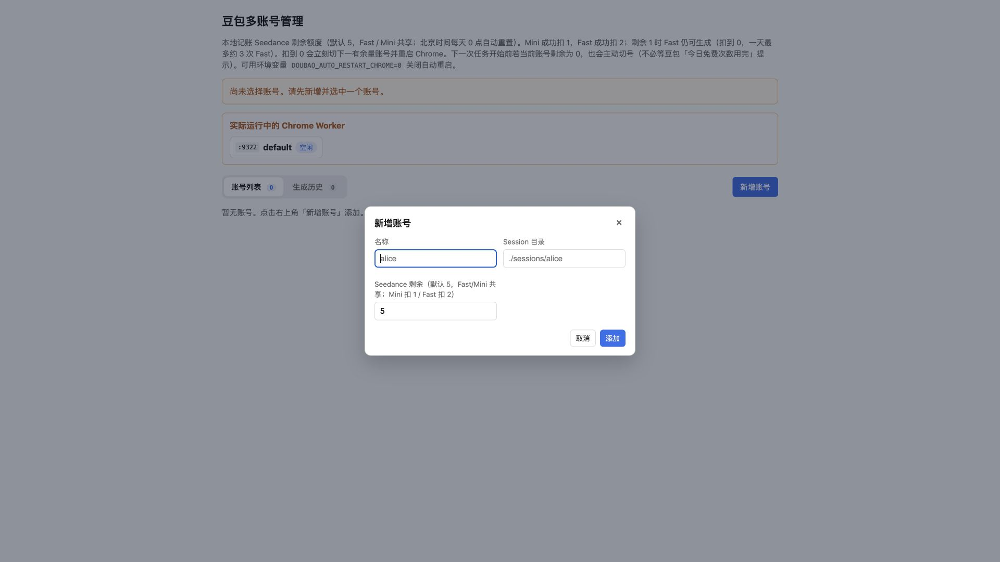
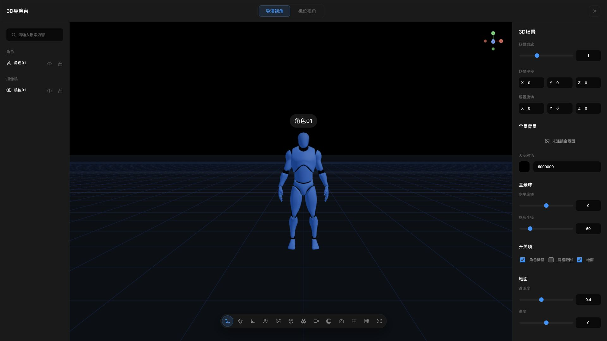
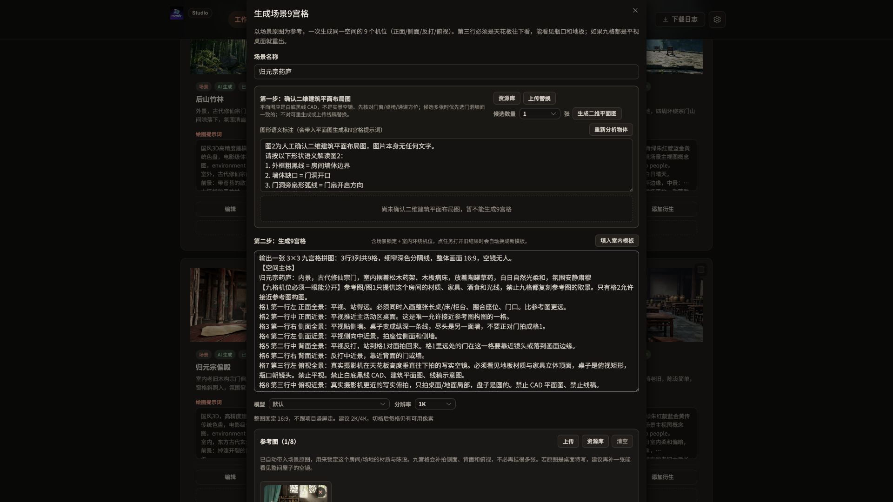
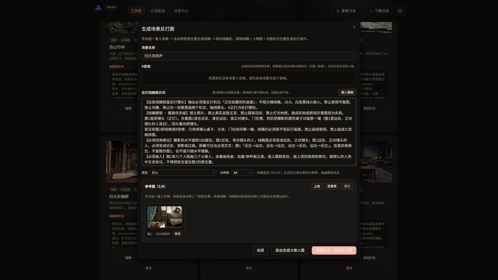
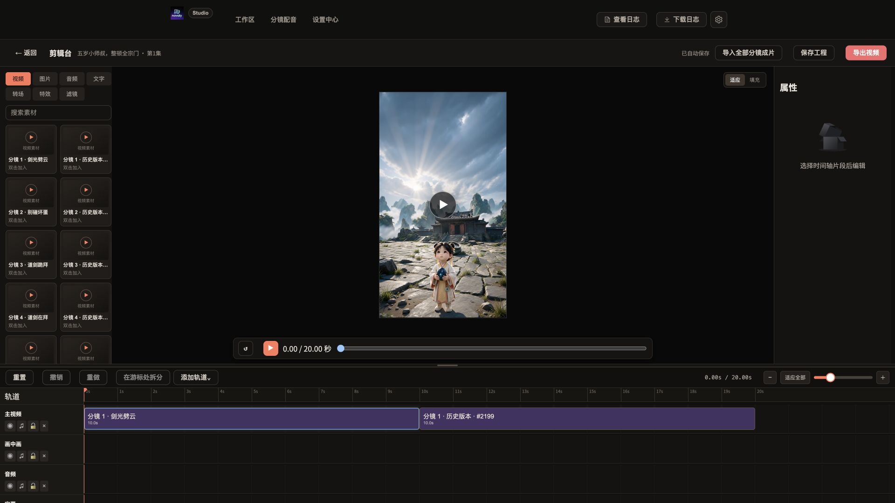

# Novaly Drama · 本地 AI 漫剧工作台

**用豆包网页 Seedance 降低视频制作成本，把多账号管理、3D 导演摆位、分镜生成和简单剪辑放进一个本地工作台。**

基于 Novaly，内置 `doubao-web-api`。项目、剧本、图片和视频保存在自己的电脑上，使用 SQLite，**不需要 COS/TOS、不需要单独部署数据库，也不必租服务器。**

[下载运行包](https://github.com/jobsonlook/novaly-drama/releases) · [安装与使用手册](docs/getting-started.md) · [Docker 部署](docs/docker.md)

## 本项目的四个特点

### 1. 豆包网页 Seedance：免费额度 + 多账号管理

**能用网页免费额度，就先用网页额度做起来。** 内置 `doubao-web-api`，登录自己的豆包账号后，在 Novaly 里调用网页端的 Seedance 视频与 Seedream 图片能力，减少另购按次计费 API 的需求。免费额度是否可用、可选模型与时长，以账号实际页面为准。

- **多账号管理：** 为不同账号保存独立浏览器会话，管理账号选择、本地额度记录、Worker 状态和生成历史。
- **工作台内启动：** 在设置中心启动豆包服务、打开账号管理，不用单独维护另一套启动流程。
- **内置真人参考图处理：** 支持生成非真人风格化参考图；站位图流程带有人物面部马赛克要求，方便准备不同用途的参考素材。原图与非真人图可以分别保留和选择。



*实际账号管理界面，展示新增账号入口；截图时列表为空，未添加虚构账号。页面中的次数是程序的本地记账规则，不是豆包官方额度承诺。参考图处理不保证通过平台审核，请仅使用有权使用的账号和肖像素材。*

### 2. 全景图 + 3D 导演台：先摆人，再定机位

场景资源支持生成 **2:1 全景图**并环视查看。把全景导入 **3D 导演台**后，可以在同一空间里安排角色位置、旋转朝向、调整机位，再从摄像机视角检查构图。

- 切换导演视角与机位视角，直观看人物前后、左右和遮挡关系。
- 支持角色、摄像机以及本地模型的管理，调整位置、旋转与缩放。
- 支持当前视角、四方位、十二方位截图。
- 从站位图流程进入导演台时，可将机位截图发送回画布，作为正式站位图的骨架参考。



*导演台真实初始界面。项目中的当前场景尚未生成全景，因此截图展示默认网格与角色；使用全景摆位前，需先在场景资源中生成或导入全景图。*

### 3. 站位图、九宫格、反打图：先确认空间，再生成成图

**把“位置对不对”和“画面好不好看”分开检查。** 先用平面图、火柴人骨架或 3D 摆位确定空间关系，再生成需要的画面，便于提前发现门窗错位、人物换边和反打方向错误。

| 模式 | 先确认什么 | 然后生成什么 |
| --- | --- | --- |
| **场景九宫格** | 从场景原图生成二维建筑平面图，核对门窗、家具和通道；支持替换线稿 | 同一空间的正面、侧面、背面、俯视等 9 个机位 |
| **人物站位图** | 按分镜文案生成火柴人骨架，或用 3D 导演台摆位截图；核对人数、坐站、朝向 | 依据已确认骨架生成正式人物站位图 |
| **反打图** | 选择场景九宫格，结合俯视布局生成反打线稿，检查前后景与左右关系 | 依据线稿、人物参考和对面机位空镜生成反打图 |



*九宫格流程明确分成两步；未确认平面布局时，正式生成按钮不可用。*

<details>
<summary>展开查看：反打图界面</summary>



</details>

这里的**场景九宫格**用于同一空间的多机位设计，与分镜里的“生成9帧图”是不同入口，不要混淆。

### 4. 内置简单剪辑：分镜生成后接着剪

已有分镜视频可以直接进入剪辑台，不必为了做一版粗剪立即切换其他软件。

- 将视频、图片和音频放到时间轴上，调整片段，按游标拆分。
- 支持主视频、画中画、音频等轨道，以及文字、转场、特效、滤镜入口。
- 可以导入分镜成片，预览、保存工程并导出视频。



*实际项目的剪辑工程。定位是简单剪辑与粗剪；复杂调色、音频后期和大型工程建议交给专业剪辑软件。目前导出为 WebM，依赖浏览器能力、可用内存与素材兼容性。*

## 从剧本到成片，怎么串起来

**建项目 → 按集写剧本 → 准备角色 / 场景 → 平面图与多机位设计 → 分镜摆位 → Seedance 生成视频 → 剪辑与导出。**

建议先做 **1 集、1 个短镜头**：固定角色和场景参考图，确认构图与动作，再扩展整集。已有素材尽量复用，排队时不要重复提交。

以上项目截图来自《五岁小师叔，整顿全宗门》，用于展示界面与工作流。历史素材可能使用不同模型，不代表每次生成都能得到相同效果。仓库不附带完整演示数据库、成片视频、API Key 或登录会话；第一次启动项目列表为空是正常的。

## 选择一种安装方式

| 方式 | 适合谁 | 怎么开始 |
| --- | --- | --- |
| **macOS Apple Silicon 运行包** | 不想安装编译工具 | [Releases](https://github.com/jobsonlook/novaly-drama/releases) 下载 `macos-arm64` 包，完整解压后运行 `启动 Novaly.command` |
| **Windows x64 预览包** | Windows 10/11 用户 | [Releases](https://github.com/jobsonlook/novaly-drama/releases) 下载 `windows-amd64` 包，完整解压后运行 `start.bat` |
| **源码运行** | 希望修改或更新源码 | 安装 Go、Node.js、Chrome 和 FFmpeg，按[使用手册](docs/getting-started.md)操作 |
| **Docker 预览方案** | 希望把浏览器和依赖一起隔离运行 | 按 [Docker 指南](docs/docker.md)构建，使用容器桌面登录豆包 |

运行包仍需本机 Chrome；视频处理需要 FFmpeg / ffprobe。Windows 包为交叉编译预览版，尚未完成 Windows 真机完整生成验证。Docker 已通过配置检查、前端构建、Go 测试和 Linux ARM64 编译，但本次镜像下载未完成，容器启动与生成流程仍待实测。

### 源码快速启动

准备好依赖后执行：

```bash
git clone https://github.com/jobsonlook/novaly-drama.git
cd novaly-drama
./start.sh
```

打开 **[http://127.0.0.1:8085](http://127.0.0.1:8085)** →「设置中心」→「启动 doubao-web-api」→ 在专用 Chrome 登录自己的豆包账号。

### Docker 快速入口

在项目根目录执行；若已运行原生版，先停止它以释放端口：

```bash
docker compose up -d --build
```

工作台仍在 `8085`，容器浏览器桌面在 `6080/vnc.html`。登录步骤、桌面密码、数据卷和迁移方式见 [Docker 完整指南](docs/docker.md)。

## 使用前知道这几件事

- **省钱不等于永久免费或无限生成。** 网页免费额度、会员权益、排队和模型可用性由平台决定；多账号管理不会增加单个账号的真实额度。
- **网页适配不是官方开放 API。** 网页改版、登录过期和风控可能导致不可用，请遵守平台条款与内容规则。
- **单机不等于离线 AI。** 生成时提示词、参考图等仍会发往所选服务；AI 写作、自动拆解、语音和其他供应商可能需要单独凭据并另行计费。
- **创作数据要自己备份。** GitHub 代码不是数据库和视频的备份，不要公开 API Key、浏览器会话或完整数据目录。

安装细节、首次登录、模型设置、日志、更新、备份恢复和常见问题统一放在 **[安装与使用手册](docs/getting-started.md)**，避免首页过长。
